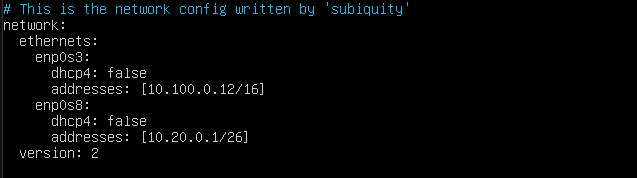

Part 1. Инструмент ipcalc
------------------------
1. Поднял виртуальную машину ws1.

2. Устанавил ipcalc `sudo apt install ipcalc`

3. Сети и маски

1. адрес сети 192.167.38.54/13
* 192.160.0.0/13
2. Перевод маски 255.255.255.0 в перфиксную и двоичную запись
* /24
* 11111111.11111111.11111111. 00000000
3. Перевод /15 вобычную и двоичную
* 255.254.0.0
* 11111111.11111110.00000000. 00000000
4. Перевод 11111111.11111111.11111111.11110000 в обычную и перфиксную
* 255.255.255.240
* /28
5. Минимальный и максимальный хост в сети 12.167.38.4 /8, 11111111.11111111.00000000.00000000, 255.255.254.0 и /4
* /8: 12.0.0.1 - 12.255.255.254
* 11111111.11111111.00000000.00000000: 12.167.38.1 - 12.167.38.254
* /255.255.254.0: 12.167.38.1 - 12.167.39.254
* /4: 1 - 254

4. localhost
1. Определить и записать в отчёт, можно ли обратиться к приложению, работающему на localhost, со следующими IP: 194.34.23.100, 127.0.0.2,          127.1.0.1, 128.0.0.1
* могут 127.0.0.2, 127.1.0.1
* не могут 194.34.23.100, 128.0.0.1

5. Диапазоны и сегменты сетей
1. Какие из перечисленных IP можно использовать в качестве публичного, а какие только в качестве частных: 10.0.0.45, 134.43.0.2, 192.168.4.2, 172.20.250.4, 172.0.2.1, 192.172.0.1, 172.68.0.2, 172.16.255.255, 10.10.10.10, 192.169.168.1
* Частные адреса начинаются со следующих чисел 10, 127, 169, 172, 192.
* Частыне: 172.16.255.255, 172.20.250.4, 192.168.4.2, 10.0.0.45, 10.10.10.10
* Публичные: 134.43.0.2, 192.169.168.1,192.172.0.1,172.0.2.1,
2. Какие из перечисленных IP адресов шлюза возможны у сети 10.10.0.0/18: 10.0.0.1, 10.10.0.2, 10.10.10.10, 10.10.100.1, 10.10.1.255
* 10.10.0.0.1, 10.10.0.2, 10.10.10.10, 10.10.1.255

Part 2. Статическая маршрутизация между двумя машинами
------------------------------------------------------

1. С помощью команды ip a посмотреть существующие сетевые интерфейсы

2. Описать сетевой интерфейс, соответствующий внутренней сети, на обеих машинах и задать следующие адреса и маски: ws1 - 192.168.100.10, маска /16, ws2 - 172.24.116.8, маска /12

3. Выполнить команду `netplan apply` для перезапуска сервиса сети

4. Добавление статического маршрута вручную

1. Добавить статический маршрут от одной машины до другой и обратно при помощи команды вида `ip r add`

2. Пропинговать соединение между машинами

5. Добавление статического маршрута с сохранением

1. Перезапустить машины `reboot`

2. Добавить статический маршрут от одной машины до другой с помощью файла etc/netplan/00-installer-config.yaml

3. Пропинговать соединение между машинами

Part 3. Утилита iperf3
---------------------

1. Перевести и записать в отчёт: 8 Mbps в MB/s, 100 MB/s в Kbps, 1 Gbps в Mbps
* 8 Mbps = 1 MB/s
* 100 MB/s = 819200 Kbps (Kilobit per second)
* 1 Gbps (Gigabit per second) = 1024 Mbps

2. Измерить скорость соединения между ws1 и ws2

Part 4. Сетевой экран
--------------------

1. Создать файл /etc/firewall.sh, имитирующий фаерволл, на ws1 и ws2:
* ws1

*ws2

2. Запустить файлы на обеих машинах командами `chmod +x /etc/firewall.sh` и `/etc/firewall.sh`

* ws1

*ws2

* Разница в том, что если сперва идет запрещающее правило, то оно не перезаписывается потом разрешающим правилом.

3. Командой ping найти машину, которая не "пингуется", после чего утилитой nmap показать, что хост машины запущен

Part 5. Статическая маршрутизация сети
-------------------------------------

1. Поднять пять виртуальных машин (3 рабочие станции (ws11, ws21, ws22) и 2 роутера (r1, r2))
2. Настроить конфигурации машин в etc/netplan/00-installer-config.yaml согласно сети на рисунке.

3. Перезапустить сервис сети. Если ошибок нет, то командой ip -4 a проверить, что адрес машины задан верно. Также пропинговать ws22 с ws21. Аналогично пропинговать r1 с ws11.

4. Для включения переадресации IP, выполните команду на роутерах: `sysctl -w net.ipv4.ip_forward=1`

5. Откройте файл /etc/sysctl.conf и добавьте в него следующую строку: `net.ipv4.ip_forward = 1`

6. Настроить маршрут по-умолчанию (шлюз) для рабочих станций. Для этого добавить gateway4 перед IP роутера в файле конфигураций. 

7. Вызвать ip r и показать, что добавился маршрут в таблицу маршрутизации

8. Пропинговать с ws11 роутер r2 и показать на r2, что пинг доходит. Для этого использовать команду: `tcpdump -tn -i enp0s3`

9. Добавить в роутеры r1 и r2 статические маршруты в файле конфигураций.

10. Вызвать `ip r` и показать таблицы с маршрутами на обоих роутерах.

11. Запустить команды на ws11:
`ip r list 10.10.0.0/[18] и ip r list 0.0.0.0/0`

* Для адреса 10.10.0.0/18 был выбран маршрут, отличный от 0.0.0.0/0, поскольку он является адресом сети и доступен без шлюза.

12. Запустить на r1 команду дампа: `tcpdump -tnv -i enp0s3`. При помощи утилиты traceroute построить список маршрутизаторов на пути от ws11 до ws21

* Путь строиться от узла к узлу до того момента, покаа не будет достигнута конечная точка. Каждый пакет проходит на своем пути определенное количество узлов, пока достигнет своей цели. На каждом узле добавляется счетчик, который отслеживает количество пройденых узлов.

13. Запустить на r1 перехват сетевого трафика, проходящего через eth0 с помощью команды: `tcpdump -n -i enp0s3 icmp`
Пропинговать с ws11 несуществующий IP (например, 10.30.0.111) с помощью команды: `ping -c 1 10.30.0.111`

Part 6. Динамическая настройка IP с помощью DHCP
------------------------------------------------

1. Для r2 настроить в файле /etc/dhcp/dhcpd.conf конфигурацию службы DHCP:

2. в файле resolv.conf прописать nameserver 8.8.8.8.

3. Перезагрузить службу DHCP командой `systemctl restart isc-dhcp-server`. Машину ws21 перезагрузить при помощи `reboot` и через `ip a` показать, что она получила адрес. Также пропинговать ws22 с ws21.

4. Указать MAC адрес у ws11, для этого в etc/netplan/00-installer-config.yaml надо добавить строки: macaddress: 10:10:10:10:10:BA, dhcp4: true

5. Для r1 настроить аналогично r2, но сделать выдачу адресов с жесткой привязкой к MAC-адресу (ws11). Провести аналогичные тесты

* в файле resolv.conf прописать nameserver 8.8.8.8.

* Перезагрузить службу DHCP командой `systemctl restart isc-dhcp-server`. Машину ws11 перезагрузить при помощи `reboot` и через `ip a` показать, что она получила адрес.

6. Запросить с ws21 обновление ip адреса

* до обновления

* для обновления используем `sudo dhclient -r enp0s3`,  `sudo dhclient enp0s3`

* после обновления

Part 7. NAT
----------

1. В файле /etc/apache2/ports.conf на ws22 и r1 изменить строку Listen 80 на Listen 0.0.0.0:80, то есть сделать сервер Apache2 общедоступным

2. Запустить веб-сервер Apache командой `service apache2 start` на ws22 и r1

3. Добавить в фаервол, созданный по аналогии с фаерволом из Части 4, на r2 следующие правила:
1) удаление правил в таблице filter - iptables -F
2) удаление правил в таблице "NAT" - iptables -F -t nat
3) отбрасывать все маршрутизируемые пакеты - iptables --policy FORWARD DROP

3. Проверить соединение между ws22 и r1 командой ping

4. Добавить в файл ещё одно правило:

4) разрешить маршрутизацию всех пакетов протокола ICMP

5. Проверить соединение между ws22 и r1 командой ping

6. Добавить в файл ещё два правила:

5) включить SNAT, а именно маскирование всех локальных ip из локальной сети, находящейся за r2 (по обозначениям из Части 5 - сеть 10.20.0.0)

6) включить DNAT на 8080 порт машины r2 и добавить к веб-серверу Apache, запущенному на ws22, доступ извне сети

7. Проверить соединение по TCP для SNAT, для этого с ws22 подключиться к серверу Apache на r1 

8. Проверить соединение по TCP для DNAT, для этого с r1 подключиться к серверу Apache на ws22 командой telnet (обращаться по адресу r2 и порту 8080)

Part 8. Дополнительно. Знакомство с SSH Tunnels
-----------------------------------------------

1. Запустить на r2 фаервол с правилами из Части 7

2. Запустить веб-сервер Apache на ws22 только на localhost (то есть в файле /etc/apache2/ports.conf изменить строку Listen 80 на Listen localhost:80)

3. Воспользоваться Local TCP forwarding с ws21 до ws22, чтобы получить доступ к веб-серверу на ws22 с ws21

4. Воспользоваться Remote TCP forwarding c ws11 до ws22, чтобы получить доступ к веб-серверу на ws22 с ws11

5. Для проверки, сработало ли подключение в обоих предыдущих пунктах, перейдите во второй терминал (например, клавишами Alt + F2)

